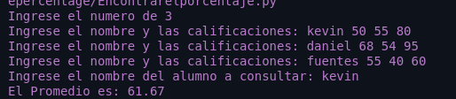

<h1 align="center"> Encontrar el porcentaje de un estudiante </h1>
<li align="center">✅Pedir la cantidad de estudiantes</li> 
<li align="center">✅Ingresar el nombre del estudiante </li> 
<li align="center"> ✅Registrar sus 3 notas (reto no pedir cantidad de notas las que sea esta bien)</li> 
<li align="center">✅Pedir el nombre del alumno </li> 
<li align="center">✅mostrar su promedio con dos digitos decimales </li> 

