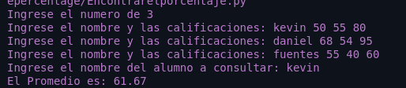

<h1 align="center"> Encontrar el porcentaje de un estudiante </h1>
<li align="center">✅Pedir la cantidad de estudiantes</li> 
✅Ingresar el nombre del estudiante 
 ✅Registrar sus 3 notas (reto no pedir cantidad de notas las que sea esta bien)
✅Pedir el nombre del alumno 
✅mostrar su promedio con dos digitos decimales 

