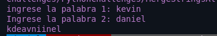

<h1 align="center">Combinar cadenas alternativas</h1>

<ul>
  <li align="center">✅Pedir primera palabra</li>
  <li align="center">✅pedir segunda palabra</li>
  <li align="center">✅Combine las cadenas agregando letras en orden alterno, comenzando con la primera palabra</li>
  <li align="center">✅Si una cadena es más larga que la otra, agregue las letras adicionales al final de la cadena fusionada</li>
  <li align="center">✅Mostrar su promedio con dos dígitos decimales</li>
</ul>

  

